# workflow
Xiao Feng  
October 12, 2016  

# Work with GIS data in R
## based on a workshop I tought in ? 


## 1. basic
Install and load libraries.


```r
# install.packages("rgdal") 
# install.packages("raster")
# install.packages("dismo")
library("rgdal") # this package is the basis of analyzing GIS data in R; for example, it handle basis coordinate systems, it defines a lot of spatial data types
```

```
## Warning: package 'rgdal' was built under R version 3.1.3
```

```
## Warning: package 'sp' was built under R version 3.1.3
```

```r
library("raster")
```

```
## Warning: package 'raster' was built under R version 3.1.3
```

```r
library("dismo")
```

```
## Warning: package 'dismo' was built under R version 3.1.3
```

## 2. warm up 
R is pretty fun to use, let's plot some maps from one line of code

```r
require("XML")
# get a map of OK, you could type text that used to search on Google Maps
myMap <- gmap("oklahoma")
raster::plot(myMap)
```

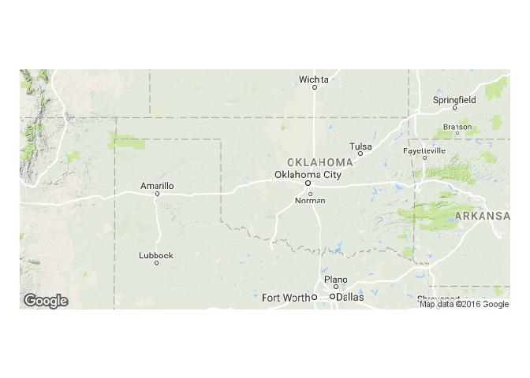<!-- -->

```r
# try different text
plot(gmap("stillwater,OK")) # seems good
```

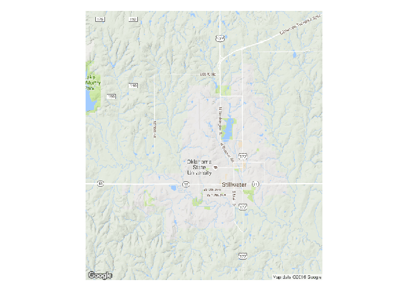<!-- -->

```r
# get a snapshot of Walmart (satellite image)
plot(gmap("walmart,stillwater,OK",type = "satellite") )
```

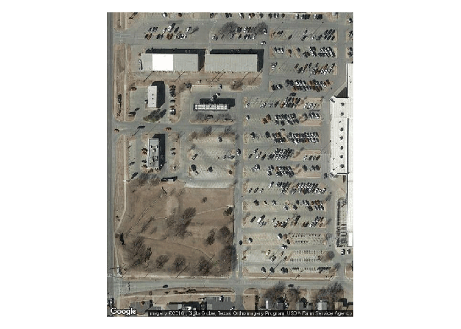<!-- -->

```r
# get a snapshot of Boomer Lake (satellite image)
plot(gmap("boomer lake,stillwater,OK",type = "satellite") )
```

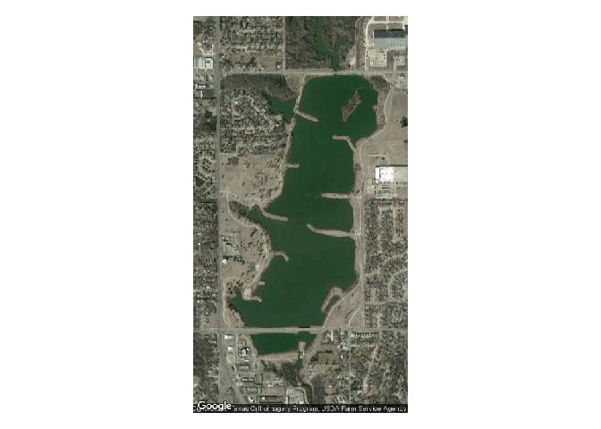<!-- -->

## 3. spatial points
### 3.1 generate spatial points


```r
# get a map of OK 
myMap <- gmap("Oklahoma",lonlat=TRUE)
```


```r
# show the extent of this map (raster)
okExtent<- extent(myMap)
okExtent
```

```
## class       : Extent 
## xmin        : -105.8468 
## xmax        : -91.56882 
## ymin        : 32.32014 
## ymax        : 38.17344
```


```r
# generate 10 random points (longitude & latitude) within this extent
myLongitude <- runif(n=10, min=okExtent[1] ,max=okExtent[2] )
myLatitude <- runif(n=10, min=okExtent[3] ,max=okExtent[4] )

# combine longitude and latitude by column
coords <- cbind(myLongitude,myLatitude)
head(coords)
```

```
##      myLongitude myLatitude
## [1,]  -102.09120   37.10437
## [2,]  -105.15997   37.23583
## [3,]   -99.49632   34.91443
## [4,]  -102.18266   33.73633
## [5,]   -98.69078   33.54935
## [6,]  -102.47841   32.46183
```


```r
# make the points spatial
myPoints <- SpatialPoints(coords)

# plot the points
plot(myPoints) # but there is no background
```

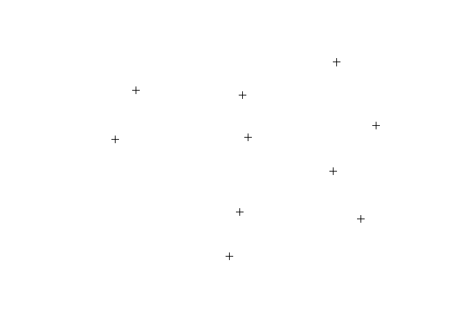<!-- -->


```r
# add some background
plot(myMap)
plot(myPoints, add=TRUE, col="red")
```

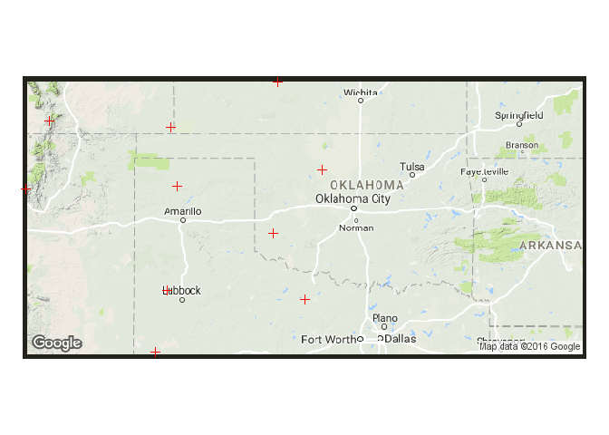<!-- -->


### 3.2 generate spatial points with attribute column


```r
# generate random attribute for the points
myAtt <- sample(c("presence","absence"),10,replace=TRUE)

# change myAtt to DataFrame
myAtt <- as.data.frame(myAtt)
head(myAtt)
```

```
##      myAtt
## 1  absence
## 2 presence
## 3 presence
## 4 presence
## 5  absence
## 6 presence
```

```r
# make spatial data frame (spatial points with attributes)
myPoints <- SpatialPointsDataFrame(coords,as.data.frame(myAtt))

# show the attribute of myPoints
myPoints@data
```

```
##       myAtt
## 1   absence
## 2  presence
## 3  presence
## 4  presence
## 5   absence
## 6  presence
## 7  presence
## 8  presence
## 9  presence
## 10 presence
```


### 3.3 select a subset of points based on attributes

```r
# This is like subsetting a dataframe
myPoints_presence <- myPoints[myPoints$myAtt=="presence", ]

# plot the previously selected points as red
plot(myPoints)
plot(myPoints_presence,add=T,col="red")
```

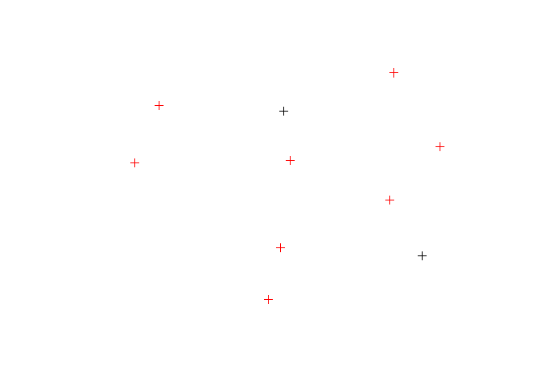<!-- -->

### 3.4 save our selected file as a shape file

```r
# the 1st parameter is the object, the 2nd parameter is the path and file name
shapefile(myPoints_presence,filename="temp/output.shp",overwrite=TRUE)
#file.exists("output.shp")
```

## 4. spatial polygons

### 4.1 build buffer of points, the unit of width depends on the geographic reference system of "myPoints"

```r
# build a dissolved buffer
myBuffer <- buffer(myPoints,width=1)
```

```
## Loading required namespace: rgeos
```

```r
length(myBuffer)
```

```
## [1] 1
```

```r
plot(myBuffer)
```

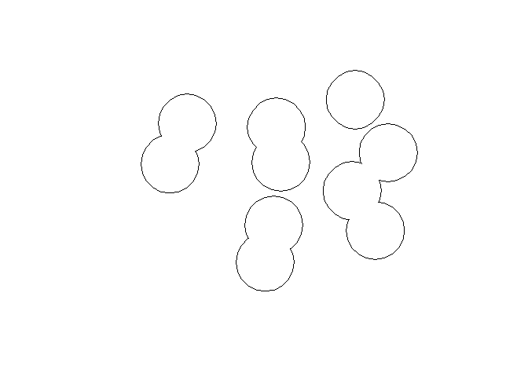<!-- -->

```r
# build buffer independently for each point
myBuffer <- buffer(myPoints,width=1,dissolve=FALSE)
length(myBuffer)
```

```
## [1] 10
```

```r
plot(myBuffer)
```

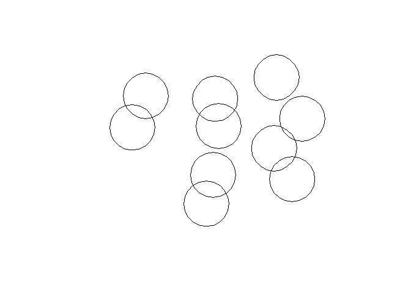<!-- -->

```r
# plot them
plot(myMap)
```

<!-- -->

```r
plot(myPoints,add=T)
plot(myBuffer,add=T)
```

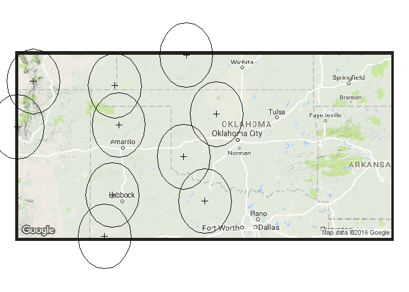<!-- -->


### 4.2 load existing polygons (data from <http://www.diva-gis.org/Data>)

```r
# use the shapefile function, which is used for export if the object is specified
map_state <- shapefile("data/USA_adm1.shp")

# show the summary of the data
summary(map_state)
```

```
## Object of class SpatialPolygonsDataFrame
## Coordinates:
##          min       max
## x -179.15056 179.77341
## y   18.90986  71.39069
## Is projected: FALSE 
## proj4string :
## [+proj=longlat +datum=WGS84 +no_defs +ellps=WGS84 +towgs84=0,0,0]
## Data attributes:
##       ID_0         ISO               NAME_0               ID_1     
##  Min.   :234   Length:51          Length:51          Min.   :3191  
##  1st Qu.:234   Class :character   Class :character   1st Qu.:3204  
##  Median :234   Mode  :character   Mode  :character   Median :3216  
##  Mean   :234                                         Mean   :3216  
##  3rd Qu.:234                                         3rd Qu.:3228  
##  Max.   :234                                         Max.   :3241  
##     NAME_1           VARNAME_1          NL_NAME_1        
##  Length:51          Length:51          Length:51         
##  Class :character   Class :character   Class :character  
##  Mode  :character   Mode  :character   Mode  :character  
##                                                          
##                                                          
##                                                          
##     HASC_1              CC_1              TYPE_1         
##  Length:51          Length:51          Length:51         
##  Class :character   Class :character   Class :character  
##  Mode  :character   Mode  :character   Mode  :character  
##                                                          
##                                                          
##                                                          
##   ENGTYPE_1          VALIDFR_1          VALIDTO_1        
##  Length:51          Length:51          Length:51         
##  Class :character   Class :character   Class :character  
##  Mode  :character   Mode  :character   Mode  :character  
##                                                          
##                                                          
##                                                          
##   REMARKS_1           Shape_Leng         Shape_Area       
##  Length:51          Min.   :  0.6128   Min.   :  0.01725  
##  Class :character   1st Qu.: 21.4184   1st Qu.:  9.81765  
##  Mode  :character   Median : 23.6599   Median : 14.65424  
##                     Mean   : 47.5481   Mean   : 21.94257  
##                     3rd Qu.: 33.5381   3rd Qu.: 23.71332  
##                     Max.   :802.6560   Max.   :281.24187
```

```r
# show the structure of the data
head(map_state@data, n=5)
```

```
##   ID_0 ISO        NAME_0 ID_1     NAME_1 VARNAME_1 NL_NAME_1 HASC_1 CC_1
## 0  234 USA United States 3191    Alabama   AL|Ala.      <NA>  US.AL <NA>
## 1  234 USA United States 3192     Alaska AK|Alaska      <NA>  US.AK <NA>
## 2  234 USA United States 3193    Arizona  AZ|Ariz.      <NA>  US.AZ <NA>
## 3  234 USA United States 3194   Arkansas   AR|Ark.      <NA>  US.AR <NA>
## 4  234 USA United States 3195 California CA|Calif.      <NA>  US.CA <NA>
##   TYPE_1 ENGTYPE_1 VALIDFR_1 VALIDTO_1 REMARKS_1 Shape_Leng Shape_Area
## 0  State     State  18170815   Present      <NA>   21.48773   12.86700
## 1  State     State  18671011   Present      <NA>  802.65598  281.24187
## 2  State     State  18670118   Present      <NA>   23.75283   28.93142
## 3  State     State  18360615   Present      <NA>   21.57045   13.58124
## 4  State     State  18500909   Present      <NA>   56.41121   41.64743
```

```r
# show one colume
map_state$NAME_1
```

```
##  [1] "Alabama"              "Alaska"               "Arizona"             
##  [4] "Arkansas"             "California"           "Colorado"            
##  [7] "Connecticut"          "Delaware"             "District of Columbia"
## [10] "Florida"              "Georgia"              "Hawaii"              
## [13] "Idaho"                "Illinois"             "Indiana"             
## [16] "Iowa"                 "Kansas"               "Kentucky"            
## [19] "Louisiana"            "Maine"                "Maryland"            
## [22] "Massachusetts"        "Michigan"             "Minnesota"           
## [25] "Mississippi"          "Missouri"             "Montana"             
## [28] "Nebraska"             "Nevada"               "New Hampshire"       
## [31] "New Jersey"           "New Mexico"           "New York"            
## [34] "North Carolina"       "North Dakota"         "Ohio"                
## [37] "Oklahoma"             "Oregon"               "Pennsylvania"        
## [40] "Rhode Island"         "South Carolina"       "South Dakota"        
## [43] "Tennessee"            "Texas"                "Utah"                
## [46] "Vermont"              "Virginia"             "Washington"          
## [49] "West Virginia"        "Wisconsin"            "Wyoming"
```

```r
# plot the data
plot(map_state)
```

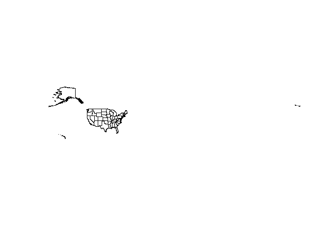<!-- -->


### 4.3 subset

```r
# only select Oklahoma
map_ok <- map_state[map_state$NAME_1 == "Oklahoma", ]
plot(map_ok)
```

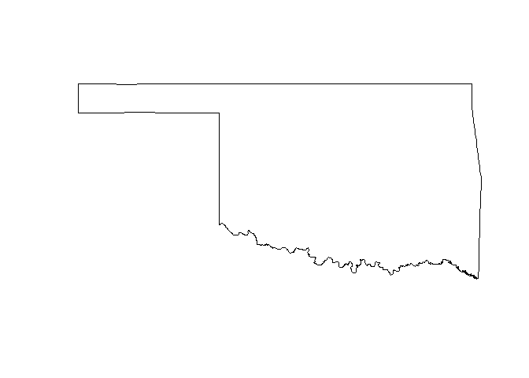<!-- -->

```r
# select states large area (> 30)
# step 1: do the logic judgement
selection <- map_state$Shape_Area > 30
# step 2: subset
map_selected <- map_state[selection,]

# the following code shows the same results, but I will nor run it.
#map_selected <- map_state[map_state$Shape_Area < 10,]

# show all columns/fields/attributes of the selections
map_selected@data
```

```
##    ID_0 ISO        NAME_0 ID_1     NAME_1 VARNAME_1 NL_NAME_1 HASC_1 CC_1
## 1   234 USA United States 3192     Alaska AK|Alaska      <NA>  US.AK <NA>
## 4   234 USA United States 3195 California CA|Calif.      <NA>  US.CA <NA>
## 26  234 USA United States 3217    Montana  MT|Mont.      <NA>  US.MT <NA>
## 31  234 USA United States 3222 New Mexico   NM|N.M.      <NA>  US.NM <NA>
## 43  234 USA United States 3234      Texas   TX|Tex.      <NA>  US.TX <NA>
##    TYPE_1 ENGTYPE_1 VALIDFR_1 VALIDTO_1 REMARKS_1 Shape_Leng Shape_Area
## 1   State     State  18671011   Present      <NA>  802.65598  281.24187
## 4   State     State  18500909   Present      <NA>   56.41121   41.64743
## 26  State     State  18640526   Present      <NA>   35.40539   45.08773
## 31  State     State  18630224   Present      <NA>   23.65993   30.88773
## 43  State     State  18500909   Present      <NA>   99.63551   65.18626
```

```r
plot(map_selected)
```

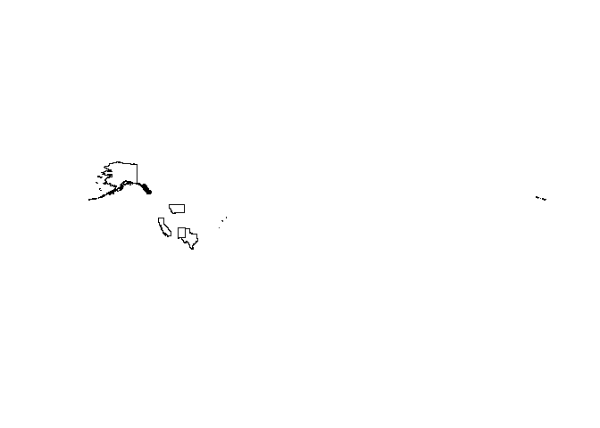<!-- -->

### 4.4 save polygons

```r
shapefile(map_selected,"temp/selected_states.shp",overwrite=TRUE)
```


## 5. spatial raster

### 5.1 read/write raster files (data from <http://www.worldclim.org>)

```r
# read one raster layer
myLayer<- raster("data/bio1.bil")
plot(myLayer)
```

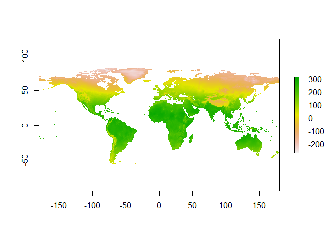<!-- -->

```r
# write one raster layer (not run)
# writeRaster(myLayer,filename="temp/ok_bio1.bil",format="EHdr",overwrite=TRUE)

# load several raster layers
# step 1 get a list of file names
list.files("data/") # we need to filter the names
```

```
##  [1] "bio1.bil"       "bio1.hdr"       "bio10.bil"      "bio10.hdr"     
##  [5] "bio11.bil"      "bio11.hdr"      "bio12.bil"      "bio12.hdr"     
##  [9] "bio13.bil"      "bio13.hdr"      "bio14.bil"      "bio14.hdr"     
## [13] "bio15.bil"      "bio15.hdr"      "bio16.bil"      "bio16.hdr"     
## [17] "bio17.bil"      "bio17.hdr"      "bio18.bil"      "bio18.hdr"     
## [21] "bio19.bil"      "bio19.hdr"      "bio2.bil"       "bio2.hdr"      
## [25] "bio3.bil"       "bio3.hdr"       "bio4.bil"       "bio4.hdr"      
## [29] "bio5.bil"       "bio5.hdr"       "bio6.bil"       "bio6.hdr"      
## [33] "bio7.bil"       "bio7.hdr"       "bio8.bil"       "bio8.hdr"      
## [37] "bio9.bil"       "bio9.hdr"       "USA_adm0.dbf"   "USA_adm0.prj"  
## [41] "USA_adm0.sbn"   "USA_adm0.sbx"   "USA_adm0.shp"   "USA_adm0.shx"  
## [45] "USA_adm1.dbf"   "USA_adm1.prj"   "USA_adm1.sbn"   "USA_adm1.sbx"  
## [49] "USA_adm1.shp"   "USA_adm1.shx"   "USA_adm2.dbf"   "USA_adm2.prj"  
## [53] "USA_adm2.sbn"   "USA_adm2.sbx"   "USA_adm2.shp"   "USA_adm2.shx"  
## [57] "USA_readme.txt"
```

```r
list.files("data/",pattern=".bil") # the names are correct, but we need the full path
```

```
##  [1] "bio1.bil"  "bio10.bil" "bio11.bil" "bio12.bil" "bio13.bil"
##  [6] "bio14.bil" "bio15.bil" "bio16.bil" "bio17.bil" "bio18.bil"
## [11] "bio19.bil" "bio2.bil"  "bio3.bil"  "bio4.bil"  "bio5.bil" 
## [16] "bio6.bil"  "bio7.bil"  "bio8.bil"  "bio9.bil"
```

```r
list.files("data/",pattern=".bil", full.names = TRUE) # the full name give you a relative path to current working directory
```

```
##  [1] "data/bio1.bil"  "data/bio10.bil" "data/bio11.bil" "data/bio12.bil"
##  [5] "data/bio13.bil" "data/bio14.bil" "data/bio15.bil" "data/bio16.bil"
##  [9] "data/bio17.bil" "data/bio18.bil" "data/bio19.bil" "data/bio2.bil" 
## [13] "data/bio3.bil"  "data/bio4.bil"  "data/bio5.bil"  "data/bio6.bil" 
## [17] "data/bio7.bil"  "data/bio8.bil"  "data/bio9.bil"
```

```r
myFiles <- list.files("data/",pattern=".bil", full.names = TRUE) 

# step 2 treat them as raster stack
myLayers <- stack(myFiles)
plot(myLayers)
```

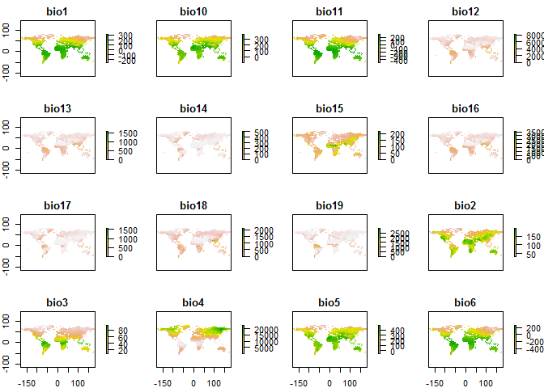<!-- -->

```r
# save several raster layers
formattedNames <- paste("temp/",names(myLayers),".bil", sep="")
formattedNames
```

```
##  [1] "temp/bio1.bil"  "temp/bio10.bil" "temp/bio11.bil" "temp/bio12.bil"
##  [5] "temp/bio13.bil" "temp/bio14.bil" "temp/bio15.bil" "temp/bio16.bil"
##  [9] "temp/bio17.bil" "temp/bio18.bil" "temp/bio19.bil" "temp/bio2.bil" 
## [13] "temp/bio3.bil"  "temp/bio4.bil"  "temp/bio5.bil"  "temp/bio6.bil" 
## [17] "temp/bio7.bil"  "temp/bio8.bil"  "temp/bio9.bil"
```

```r
# not run
# writeRaster(myLayers,filename= formattedNames, format="EHdr", bylayer=TRUE)
```

### 5.2 extraction by polygon

```r
# we only want to show Oklahoma, extract raster layer by polygon
raster_ok <- mask(myLayer, map_ok) # we may get error if the reference systems are different
```

### 5.3 projection

```r
# check their CRS
crs(myLayer)
```

```
## CRS arguments:
##  +proj=longlat +ellps=WGS84 +towgs84=0,0,0,0,0,0,0 +no_defs
```

```r
crs(map_ok)
```

```
## CRS arguments:
##  +proj=longlat +datum=WGS84 +no_defs +ellps=WGS84 +towgs84=0,0,0
```

```r
# unify the CRS
map_ok_new <- spTransform(map_ok, crs(myLayer))
crs(map_ok_new)
```

```
## CRS arguments:
##  +proj=longlat +ellps=WGS84 +towgs84=0,0,0,0,0,0,0 +no_defs
```

```r
# extract raster by polygon 
raster_ok <- crop( myLayer ,extent(map_ok_new) ) # first cut by a rectangle
raster_ok <- mask(raster_ok, map_ok_new) # then cut by boundary
plot(raster_ok)
```

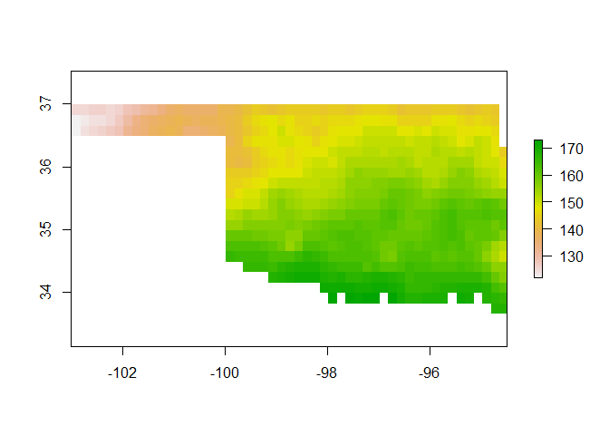<!-- -->

### 5.4 extract by point

```r
extract(raster_ok,myPoints)
```

```
##  [1]  NA  NA 159  NA  NA  NA  NA  NA  NA 148
```

### 5.5 resample

```r
# we want the new layer to be 3 times coarser at each axis (9 times coarser)
# read current resolution
raster_ok
```

```
## class       : RasterLayer 
## dimensions  : 20, 51, 1020  (nrow, ncol, ncell)
## resolution  : 0.1666667, 0.1666667  (x, y)
## extent      : -103, -94.5, 33.66667, 37  (xmin, xmax, ymin, ymax)
## coord. ref. : +proj=longlat +ellps=WGS84 +towgs84=0,0,0,0,0,0,0 +no_defs 
## data source : in memory
## names       : bio1 
## values      : 122, 173  (min, max)
```

```r
nrow(raster_ok)
```

```
## [1] 20
```

```r
ncol(raster_ok)
```

```
## [1] 51
```

```r
extent(raster_ok)
```

```
## class       : Extent 
## xmin        : -103 
## xmax        : -94.5 
## ymin        : 33.66667 
## ymax        : 37
```

```r
# define new resolution
newRaster <- raster( nrow= nrow(raster_ok)/3 , ncol= ncol(raster_ok)/3 )

# define extent
extent(newRaster) <- extent(raster_ok)

# fill the new layer with new values
newRaster <- resample(x=raster_ok,y=newRaster,method='bilinear')
plot(newRaster) # new layer seems coarser
```

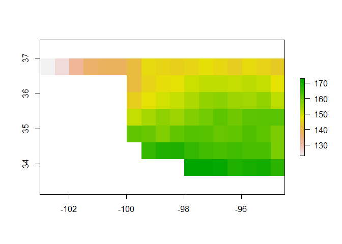<!-- -->

### 5.6 reclassify raster layer

```r
# we want to classify the world into two classes based on temperature, high > mean & low < mean
myLayer<- raster("data/bio1.bil")

# values smaller than meanT becomes 1; values larger than meanT will be 2
myMethod <- c(-Inf, 100, 1,  100, Inf, 2)
myLayer_classified <- reclassify(myLayer,rcl= myMethod)
plot(myLayer_classified)
```

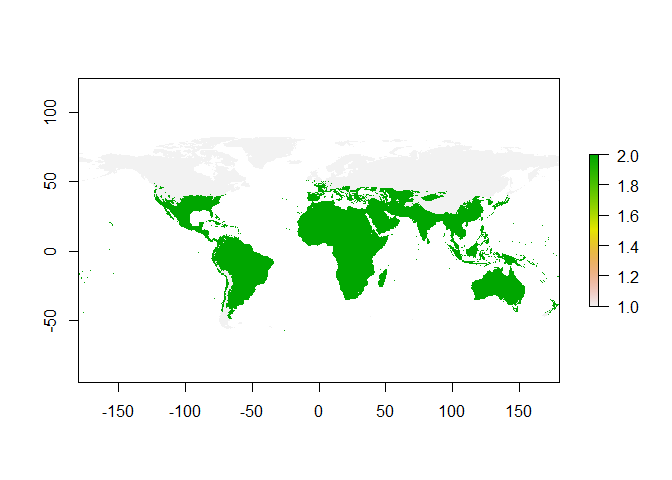<!-- -->

### 5.7 raster calculation

```r
# read precipitation data 
wet <- raster("data/bio13.bil") # precipitation of wettest month
dry <- raster("data/bio14.bil") # precipitation of driest month
plot(stack(wet,dry))
```

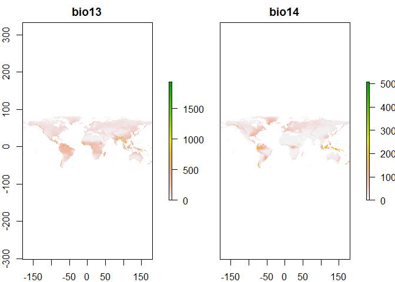<!-- -->

```r
# calculate the difference
diff <- wet - dry
#plot(diff)

# calculate the mean of the two month
twoLayers <- stack(wet,dry)
meanPPT <- calc(twoLayers,fun=mean)
#plot(meanPPT)

# the following code gives the same results
meanPPT2 <-  (wet + dry)/2

# histogram of one layer
hist(twoLayers[[1]])
```

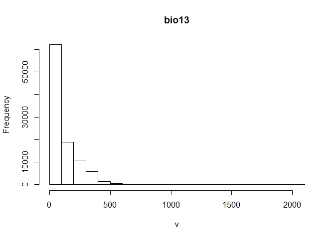<!-- -->

```r
# correlation between different layers
pairs(twoLayers[[1:2]])
```

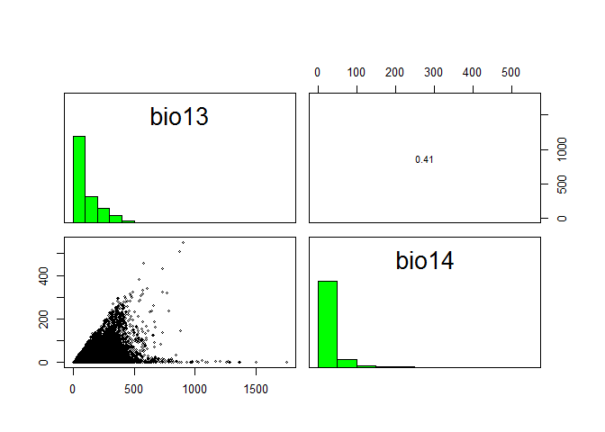<!-- -->

################################


## references
1. Spatial data in R: Using R as a GIS <http://pakillo.github.io/R-GIS-tutorial/>
